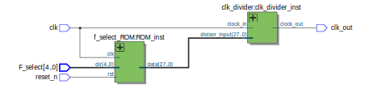
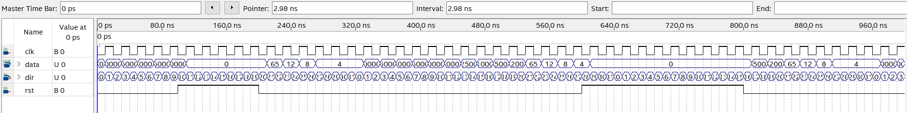
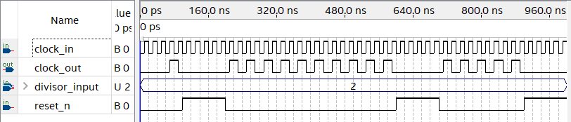

  

# Clock Frequency Divider ROM Control

- [Read the documentation for project](docs/info.md)

## Clock frequency Rivider ROM controled

This project is based on the necessity to have different clock frequencies for designing real-time clocks, using microprocessors, microcontrollers, or other devices.
# Block diagram

  

As we can see in the block diagram, this project is composed of two parts. One part is a ROM for frequency selection. This ROM contains the necessary parameters to divide the clock input. The second part is a counter to divide the input clock frequency.

## ROM
This ROM contains the nesesaria parameters to select the frequency needed out of 27 frecuencies, the calculus of parameters is base on the next formula:
`Divisor = clk_in / clk_out` 
Where:
- `clk_in` = Frequency of the input clock (in Hz)
- `clk_out` = Frequency of the output clock (in Hz)
- `DIVISOR` = Parameter value used to divide the input clock frequency
This parameter is the one we have on our rom this well drive our counter when we need to divide the frequency.
The next table enlist the parameters and frequencyies to be selected on the ROM:

| Address | Divider    | Frequency (Hz) |
| ------- | ---------- | --------------- |
| 0       | 50,000,000 | 1               |
| 1       | 5,000,000  | 10              |
| 2       | 2,500,000  | 20              |
| 3       | 2,000,000  | 25              |
| 4       | 1,000,000  | 50              |
| 5       | 500,000    | 100             |
| 6       | 250,000    | 200             |
| 7       | 200,000    | 250             |
| 8       | 100,000    | 500             |
| 9       | 66,667     | 750.005         |
| 10      | 50,000     | 1000            |
| 11      | 5,000      | 10,000          |
| 12      | 2,500      | 20,000          |
| 13      | 2,000      | 25,000          |
| 14      | 1,000      | 50,000          |
| 15      | 665        | 75,188.7        |
| 16      | 500        | 100,000         |
| 17      | 250        | 200,000         |
| 18      | 200        | 250,000         |
| 19      | 100        | 500,000         |
| 20      | 65         | 769,231         |
| 21      | 50         | 1,000,000       |
| 22      | 12         | 4,166,667       |
| 23      | 10         | 5,000,000       |
| 24      | 8          | 6,250,000       |
| 25      | 6          | 8,333,333       |
| 26      | 4          | 12,500,000      |
| 27      | 2          | 25,000,000      |

The ROM is driven by a clock signal and four address select bits. When the reset signal, reset_n, is triggered, the ROM will return to address 0, causing the output to return to 0 until the next rising edge of the clock signal.

### Simulation
Simulation was done using intel quartus prime lite universal wave form

  

As you can see the ROM will give the value selected while reset_n signal is not activated.
## Clock divider
clk_divider, serves to divide an input clock signal (clock_in) by a specified divisor (divisor_input). Upon initialization or when a reset signal (reset_n) is activated, the internal counter (counter) and output clock (clock_out) are reset to zero. Subsequently, on each rising edge of clock_in, the counter increments until it reaches the divisor value minus one. If the divisor input changes, the divisor is updated, and the counter is reset.

For cases where the divisor isn't an exact multiple of 50 MHz (the typical clock frequency), two flip-flops are utilized to synchronize the output clock (clock_out). The first flip-flop toggles when the counter value is less than half of the divisor, while the second flip-flop mirrors the first one to ensure synchronization. This setup ensures proper operation regardless of the input clock's frequency relationship with 50 MHz. However, if the divisor matches 50 MHz precisely, the input clock is directly passed to the output without any manipulation, streamlining the process for exact frequency multiples.

### Simulation
In this simulation, a 25 MHz frequency was selected for demonstration purposes. As depicted in the accompanying image, if the divider is set to 2, the clock signal will be generated every 2 clock cycles with a 50% duty cycle. When the divider is reset, the clock signal will halt until the reset_n signal transitions LOW again.

  

As you can see mode modules work as spected.
## Resources Employed

- **OpenLane:** Used to automatically compile ASIC files.
- **Verilog:** Hardware description language used to implement the design.
- **Verilog Simulator:** Employed to verify the functionality of the design through simulations.
- **Quartus Prime 18.1:** Employed to design and simulate the design.
- **Terrasic DE10 LITE:** Employed to test core inside an FPGA.

## GDS and Tiny Tapeout layout
The design was compiled under the Tiny Tapeout submission template for fabrication. As you can see at the top of this description, the design has passed all the GDS generation tests, so it's eligible for fabrication.

# Tiny Tapeout Chip Pins Layout

As for fabrication, the template provides us with 24 pins which are named as follows:

    

The next table list the pins used acording with the package pins.
| Pin Name   | Source Name | I/O    | Description          | Purpose                              | Parameters              |
|------------|-------------|--------|----------------------|--------------------------------------|-------------------------|
| in_out[0]  | clk         | Input  | Clock Signal         | Synchronizes data                   | 50MHz clock signal      |
| in[5]      | reset_n     | Input  | Reset Signal         | Returns the system to its initial state | Active HIGH             |
| in[4:0]    | F_select    | Input  | Frequency Select     | Selects ROM address and divider parameters | Active HIGH             |
| in_out[1]  | clk_out     | Output | Clock Signal         | Output of the divided clock signal  | Clock signal ranging from 25MHz to 1Hz |

