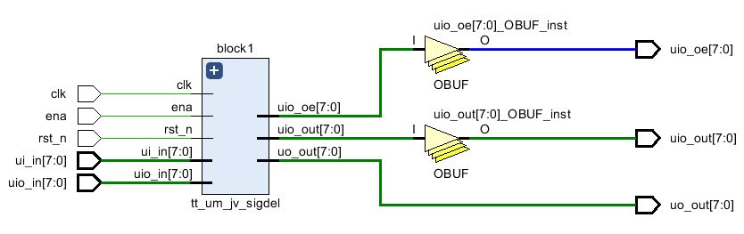
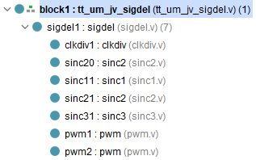

  

# Tiny Tapeout Verilog Project Template

# Modified for a 1st order passive sigma delta ADC

- [Read the documentation for project](docs/info.md)

## What is Tiny Tapeout?

TinyTapeout is an educational project that aims to make it easier and cheaper than ever to get your digital designs manufactured on a real chip.

To learn more and get started, visit https://tinytapeout.com.

A digital project can use a tile of Tiny Tapeout.

Inputs are clk (fCLKmax = 50MHz), ena, rst_n (reset active low), ui_in[7:0] and uio_on[7:}].

Outputs are uio_oe{7:0], uio_out[7:0] and uo_out[7:0]

[The Tech specs section gives details](https://www.tinytapeout.com/specs/pcb/)

## Verilog Projects

1. Add your Verilog files to the `src` folder

All the used verilog files are shown here.

2. Edit the [info.yaml](info.yaml) and update information about your project, paying special attention to the `source_files` and `top_module` properties. If you are upgrading an existing Tiny Tapeout project, check out our [online info.yaml migration tool](https://tinytapeout.github.io/tt-yaml-upgrade-tool/).

Inputs:

  ui[0]: "Input voltage input voltage R1, uo5 R2, C attached"

  ui[1]: "Sampling clock conf1"
  
  ui[2]: "Sampling clock conf2"
  
  ui[3]: "OSR conf1"
  
  ui[4]: "OSR conf2"
  
  ui[5]: "SINC1,2,3 conf1"
  
  ui[6]: "SINC1,2,3 conf2"
  
  ui[7]: "pwm output enable"

Outputs:

  uo[0]: "ADC 0 LSB"
 
  uo[1]: "ADC 1"
  
  uo[2]: "ADC 2"
  
  uo[3]: "ADC 3 MSB"
  
  uo[4]: "replicate ui0"
  
  uo[5]: "invert ui0 R2"
  
  uo[6]: "pwm upper"
  
  uo[7]: "pwm lower"
   
3. Edit [docs/info.md](docs/info.md) and add a description of your project.
4. Optionally, add a testbench to the `test` folder. See [test/README.md](test/README.md) for more information.

The GitHub action will automatically build the ASIC files using [OpenLane](https://www.zerotoasiccourse.com/terminology/openlane/).

## Enable GitHub actions to build the results page

- [Enabling GitHub Pages](https://tinytapeout.com/faq/#my-github-action-is-failing-on-the-pages-part)

## Resources

- [FAQ](https://tinytapeout.com/faq/)
- [Digital design lessons](https://tinytapeout.com/digital_design/)
- [Learn how semiconductors work](https://tinytapeout.com/siliwiz/)
- [Join the community](https://tinytapeout.com/discord)
- [Build your design locally](https://docs.google.com/document/d/1aUUZ1jthRpg4QURIIyzlOaPWlmQzr-jBn3wZipVUPt4)

## What next?

- [Submit your design to the next shuttle](https://app.tinytapeout.com/).
- [Do a revision](https://app.tinytapeout.com/projects/436).
- Edit [this README](README.md) and explain your design, how it works, and how to test it.
- Share your project on your social network of choice:
  - LinkedIn [#tinytapeout](https://www.linkedin.com/search/results/content/?keywords=%23tinytapeout) [@TinyTapeout](https://www.linkedin.com/company/100708654/)
  - Mastodon [#tinytapeout](https://chaos.social/tags/tinytapeout) [@matthewvenn](https://chaos.social/@matthewvenn)
  - X (formerly Twitter) [#tinytapeout](https://twitter.com/hashtag/tinytapeout) [@matthewvenn](https://twitter.com/matthewvenn)
