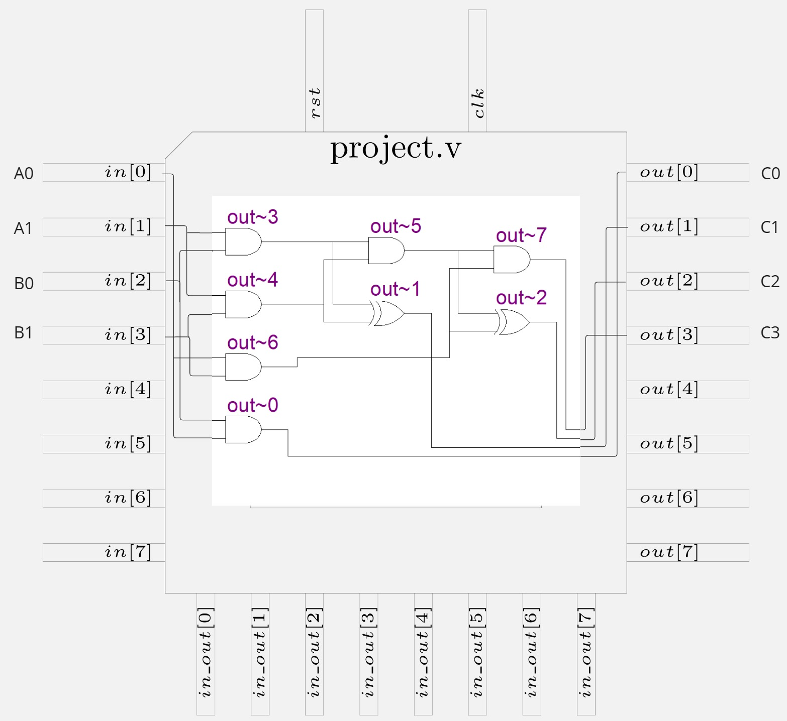

  

# Multiplicador de 2 bits

EL proyecto es un multiplicador sencillo de 2 bits para cada entrada a,b. Se realizó describiendo el circuito con compiertas lógicas utilizando multiplicaciones con compuertas AND y medios sumadores con la combinación de compuertas AND y XOR. Este circuito es completamente combinacional y es una aplicación práctica sencilla y didáctica para obtener un circuito físico final a partir de la descripción en verilog.
  

  |  A1  |  A0  |  B1  |  B0  |  P3  |  P2  |  P1  |  P0  |
  | ---- | ---- | ---- | ---- | ---- | ---- | ---- | ---- |
  |   0  |   0  |   0  |   0  |   0  |   0  |   0  |   0  |
  |   0  |   0  |   0  |   1  |   0  |   0  |   0  |   0  |
  |   0  |   0  |   1  |   0  |   0  |   0  |   0  |   0  |
  |   0  |   0  |   1  |   1  |   0  |   0  |   0  |   0  |
  |   0  |   1  |   0  |   0  |   0  |   0  |   0  |   0  |
  |   0  |   1  |   0  |   1  |   0  |   0  |   0  |   1  |
  |   0  |   1  |   1  |   0  |   0  |   0  |   1  |   0  |
  |   0  |   1  |   1  |   1  |   0  |   0  |   1  |   1  |
  |   1  |   0  |   0  |   0  |   0  |   0  |   0  |   0  |
  |   1  |   0  |   0  |   1  |   0  |   0  |   1  |   0  |
  |   1  |   0  |   1  |   0  |   0  |   1  |   0  |   0  |
  |   1  |   0  |   1  |   1  |   0  |   1  |   1  |   0  |
  |   1  |   1  |   0  |   0  |   0  |   0  |   0  |   0  |
  |   1  |   1  |   0  |   1  |   0  |   0  |   1  |   1  |
  |   1  |   1  |   1  |   0  |   0  |   1  |   1  |   0  |
  |   1  |   1  |   1  |   1  |   1  |   0  |   0  |   1  |

## How to test

Las entradas del circuito de 2 bits, a y b, deben conectarse a interruptores como lo pueden ser DIP switch, con sus respectivas resistencias. Las salida out de 4 bits se puede conectar a leds, de igual manera con sus respectivas resistencias para evitar dañar algún componente.

## External hardware

El hardware externo utilizado es:

-DIP switch 4 posiciones.
-4 lEDS.
